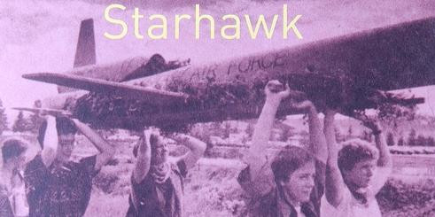

# Atelier _Le temps des bûchers_

## Découvrir les origines de notre culture de la distance

Un atelier en ligne de lecture collective de 2h **dimanche 4 juin à 17h30** pour entrer dans la pensée écoféministe.

> Nous survivons dans la culture de la distance ; pour combien de temps, nul ne le sait. Mais pour transformer cette culture intelligemment, nous devons la comprendre, trouver ses racines, connaître son histoire - parce que le passé est toujours vivant dans le présent.

[_Le temps des bûchers_, Starhawk,  1982.[1]](citations-le-temps-des-bûchers.md) (extraits)

Pas besoin d'avoir acheté le livre ni de l'avoir parcouru avant. Chaque personne recevra quelque pages du texte lors de l'évènement. Nous lirons nos parties individuellement puis mettrons en commun ce que nous en aurons compris.

Cette technique de lecture s’appelle un [arpentage](arpentage-une-lecture-collective.md)

### Intentions

Nous espérons :
* Rencontrer la pensée de l'autrice
* Entendre d'autres personnes recevoir son texte
* S'entrainer à arpenter un texte

### Ce qui pourrait vous déplaire dans _Le temps des bûchers_ de Starhawk
_Le temps des bûchers_ véhicule une vision positive des sujets suivants :

* le paganisme,
* les sorcières,
* le Moyen Âge.

Prenez soin de vous, ne venez pas si cela peut heurter vos convictions.

### Comment participer

Vous pouvez recevoir le lien de participation [par mail](https://tally.so#tally-open=wb99W1&tally-hide-title=1&tally-auto-close=1000) ou contacter directement une organisatrice.

### En réponse à des questions déjà posées :

* Je peux assister à la session sans participer à la lecture elle-même, pour observer.
* Je peux éteindre ma caméra.
* Je peux diffuser les liens de connexions à des personne que je jugerais pertinentes.
* Ma participation est légitime dès lors que je dispose du lien de connexion.
* Je peux recevoir en avance un morceau d'arpentage si j'ai envie de le préparer.
 
### Précisions par Fred (iel/il/elle) et _Philippe (il)_

- [Ce que cette organisation nous apporte](besoins-nourris.md)
- [Comment nous préparons cet arpentage](préparation-le-temps-des-bûchers.md)
- [Nous utilisons le féminin comme neutre](nous-utilisons-le-féminin-comme-neutre.md)

