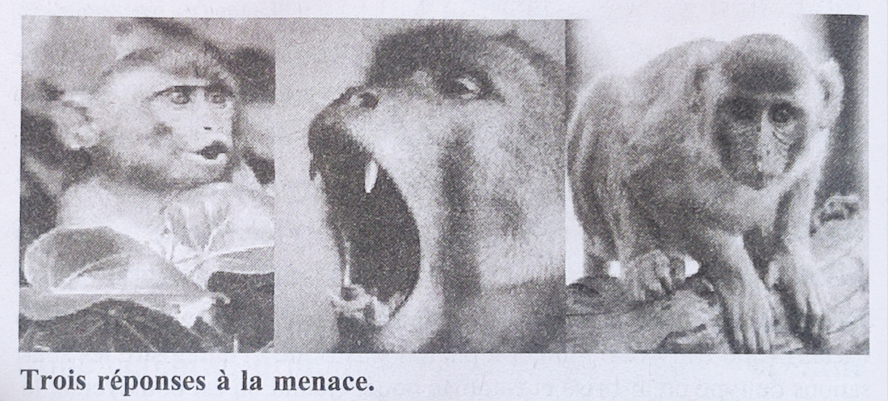

# Arpenter _Le corps n'oublie rien_ de Bessel Van Der Kolk

## Comprendre le syndrome de stress post-traumatique

Ses origines, sa mise en évidence, ses traitements.

> 1980 - un groupe de vétérans du Viêtnam [...] fait pression sur l'Association psychiatrique américaine pour la création d'un nouveau diagnostique : le syndrome de stress post-traumatique [...] (le fameux _DSM-III_, **M**anuel **D**iagnostique et **S**tatistique des troubles mentaux)

> 1982 - le manuel de psychiatrie classique disait que l'inceste était extrêmement rare aux Etats-Unis. D'après lui, seule une femme sur un million en était victime. L'amérique comptant alors 100 millions de citoyennes, je me suis demandé comment quarante-sept d'entre elles - soit la moitié du pourcentage officiel - avaient pu trouver le chemin de mon bureau, dans les sous-sols de l'hôpital !

> Pour qu'il y ai un vrai changement, le corps doit réaliser que le danger est passé

> De nombreux traumatisés semblent rechercher des expériences qui effraieraient la plupart des gens, et se plaignent souvent d'une impression de vide et d'ennui quand ils ne sont pas en colère, sous perssion, ou pris par une activité dangereuse.

### Déroulement

Pas besoin d'avoir acheté le livre ni de l'avoir parcouru avant. Chaque personne aura à lire quelques pages du texte individuellement. Nous mettrons ensuite en commun ce que nous en aurons compris.

### Comment participer

Vous pouvez recevoir le lien de participation [par mail](https://tally.so#tally-open=wb99W1&tally-hide-title=1&tally-auto-close=1000) ou contacter directement une organisatrice.

## En réponse à des questions déjà posées :

* Je peux venir observer sans participer à la lecture elle-même.
* Je peux éteindre ma caméra.
* Je peux diffuser les liens de connexions.
* Ma participation est légitime dès lors que je dispose du lien de connexion.
* Je peux recevoir en avance un morceau d'arpentage, pour m'en faire une idée ou le préparer.
* Je peux faire la lecture en binôme.
 
# Arpentages précédents

[Enclosures et expropriation des connaissances](atelier-starhawk-le-temps-des-buchers.md) - les racines de la pensée écoféministe.
- [Ce que cette organisation apporte à _Fred (iel/il/elle)_ et _Philippe (il)_](besoins-nourris.md)
- [Nous utilisons le féminin comme neutre](nous-utilisons-le-féminin-comme-neutre.md)
- [Comment nous préparons cet arpentage](préparation-le-temps-des-bûchers.md)
- [Comment répartir les pages](répartir-pages.md)

